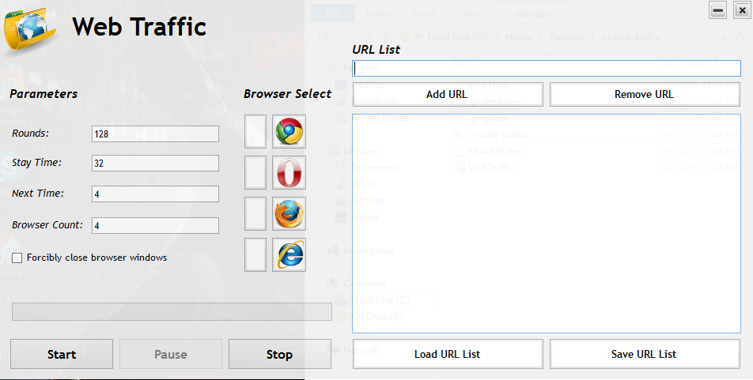
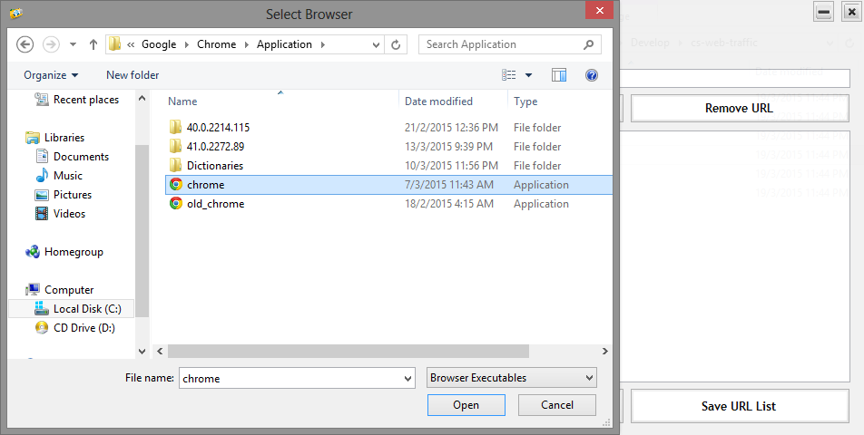
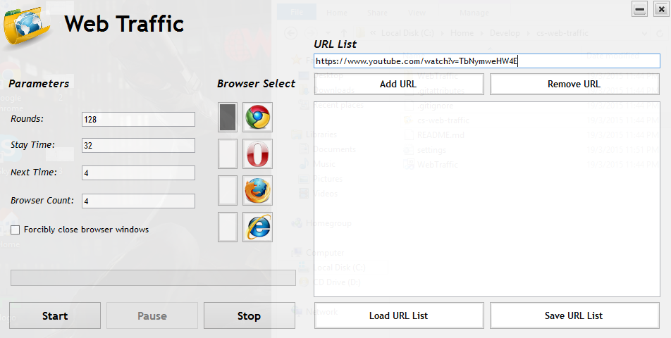
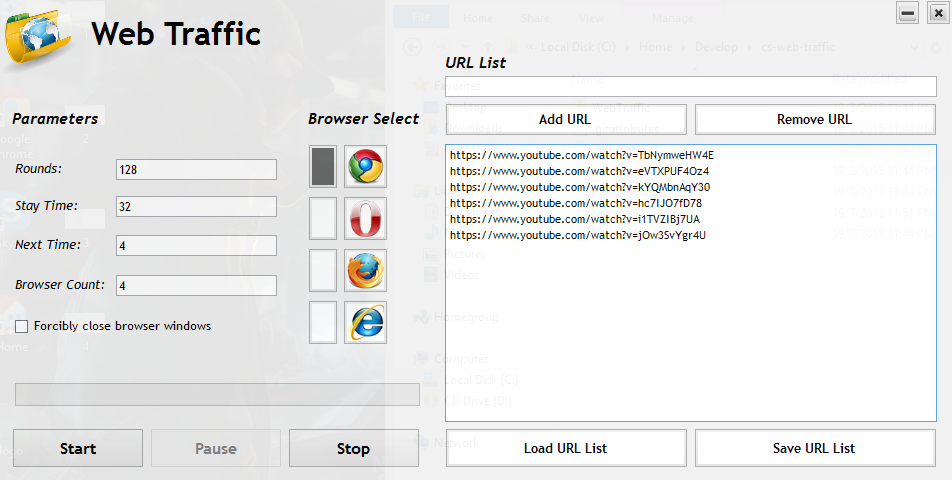
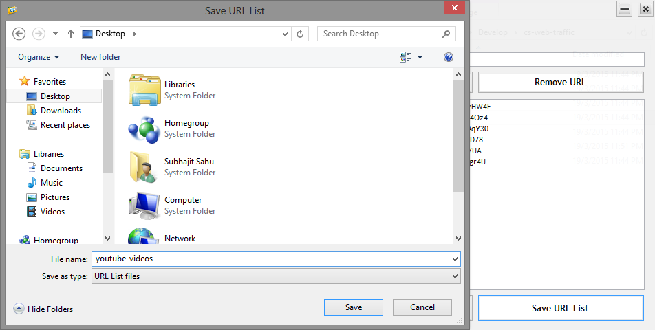
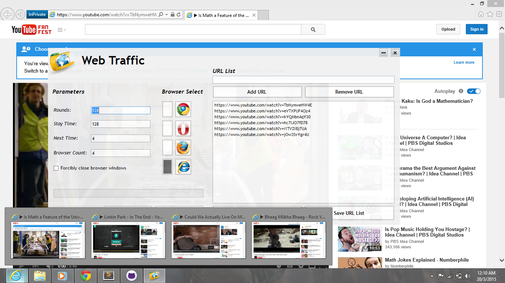
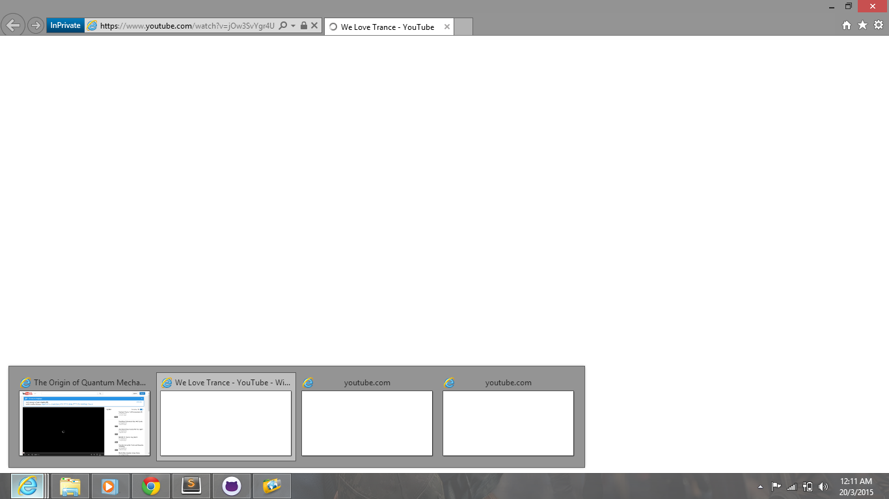
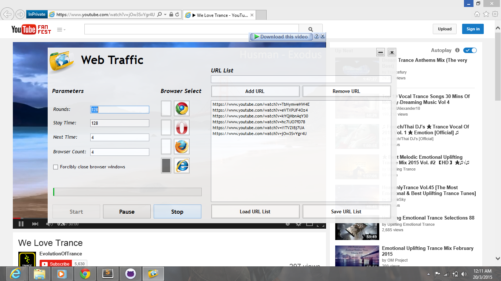

**WebsiteTraffic** is a windows app to generate traffic to one or multiple
websites as a bot for selected duration.
 
 

 
Open **WebsiteTraffic**. Old settings are loaded automatically.
 
 

 
`Select Browser` Path for Google Chrome (first time only).
 
 

 
`Select Browser` Path for Internet Explorer (first time only).
 
 

 
Now Google Chrome or Internet Explorer can be selected.  
Selected choice is saved automatically.
 
 

 
Add URLs to be auto-viewed in `URL List` using `Add URL`.
 
 

 
`Remove URL` can be used to remove a specific URL.
 
 

 
`Save URL list` to a location (optional).  
This way it can be loaded back later.
 
 

 
`Load URL list` from a location (optional).
 
 

 
`Rounds` is no. of times to perform auto-view.  
`Stay Time` is the view time of a page (URL).  
`Next Time` time delay between 2 consecutive views.  
`Browser Count` is the number of browser windows to use.  
`Browser Select` Internet Explorer and `Start`.
 
 

 
**WebsiteTraffic** automatically opens up pages mentioned in the `URL List`.
 
 

 
After `Stay Time` next batch of 4 URLs is accessed.
 
 

 
Progress is calculated based or desired `Rounds`.
 
 

 
`Stop` closes all opened browser windows.
 
 

